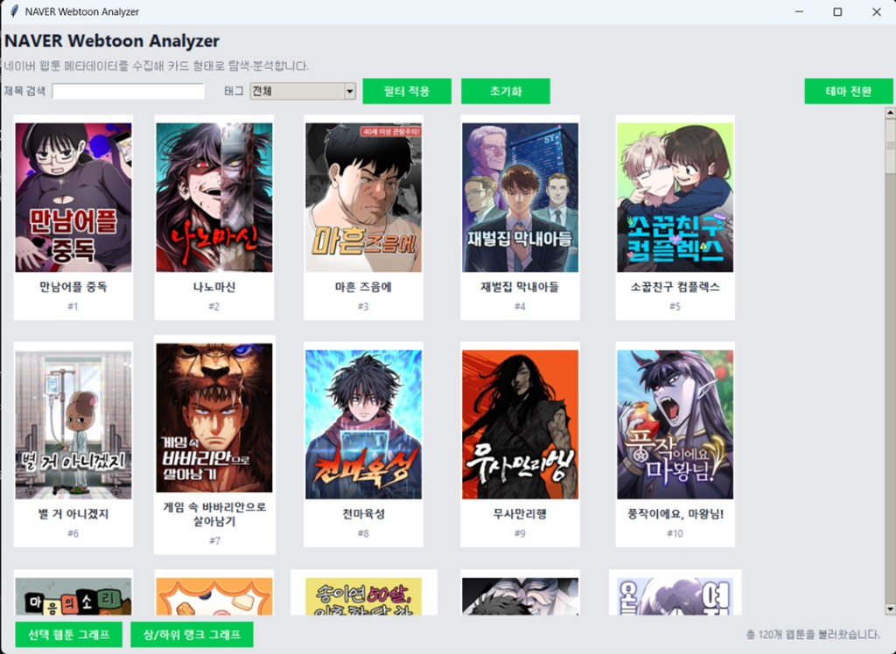
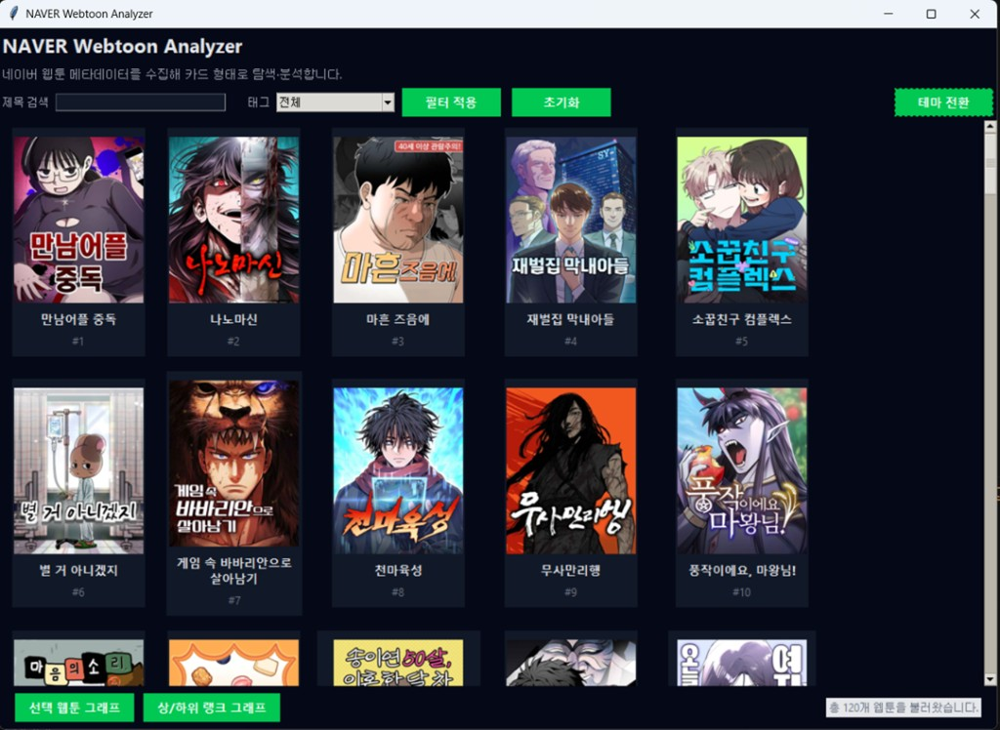
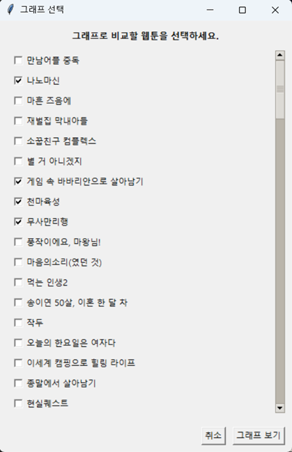
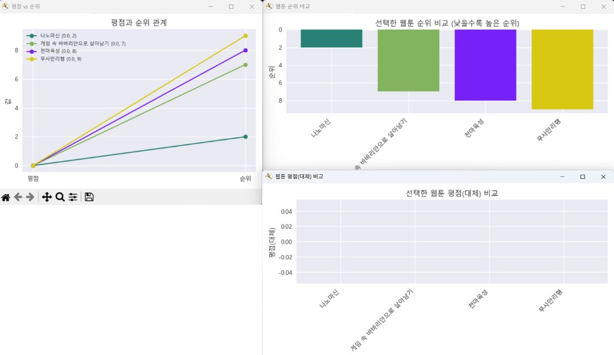

# NAVER Webtoon Analyzer

네이버 웹툰 메타데이터를 수집하고(Export), 카드형 UI로 탐색하며(Viewer), 간단한 rank 기반 분석(Analysis)을 수행하는 미니 툴 세트입니다.

> 본 프로젝트에서 사용하는 `rank`는 네이버 웹툰 `weekday` API가 반환하는 **기본 정렬 순서**를 **노출 우선순위의 proxy 지표**로 해석해 사용했습니다. (조회수/매출/내부 평점 등 “공식 인기 지표”와 동일하다고 가정하지 않습니다.)

## 핵심 기능

- **데이터 수집/정규화**
  - `export_webtoons.py` 실행 시 `webtoons.json`, `webtoons.csv` 생성
  - 사람이 보기 좋은 `webtoons_pretty.csv`도 함께 생성(엑셀/노션용)
- **탐색용 카드 UI (Tkinter)**
  - 썸네일/제목/번호(#rank) 카드 뷰
  - 제목 검색, 태그 필터(구조), 초기화, 마우스 휠 스크롤
  - 라이트/다크 테마 전환
  - 이미지 캐시로 필터 반응 속도 개선
- **간단 분석 스크립트**
  - `analyze_catalog.py`: rank 기준 상위/하위 작품 리스트 출력 + 기초 통계
  - `analyze_rank_plot.py`: 상위/하위 10개 작품을 막대 그래프로 시각화

## 프로젝트 구조

```
webtoon_analyzer/
  main.py                 # 카드형 탐색 UI
  crawler.py              # API 기반 수집 로직(기본 리스트)
  export_webtoons.py       # json/csv export
  graph_window.py          # 선택 웹툰 비교 그래프(기존 UI)
  analyze_catalog.py       # 콘솔 분석(상/하위 리스트)
  analyze_rank_plot.py     # 시각화(상/하위 10개)
  requirements.txt
```

## 실행 방법

### 1) 의존성 설치

```bash
pip install -r requirements.txt
```

### 2) 데이터 생성 (필수)

```bash
python export_webtoons.py
```

실행 후 아래 파일이 생성됩니다.

- `webtoons.json`
- `webtoons.csv`
- `webtoons_pretty.csv`

### 3) 탐색 UI 실행

```bash
python main.py
```

### 4) 분석 실행

```bash
python analyze_catalog.py
python analyze_rank_plot.py
```

## 분석 요약(예시)

- rank 상위 구간과 하위 구간의 작품 리스트를 비교해, 노출 순서가 단순 인기순이 아닌 **편성/노출 전략이 혼합된 결과**일 수 있음을 관찰했습니다.
- 상위 구간에는 신작/중작이, 하위 구간에는 인지도가 높은 장기 연재작이 함께 포함되는 패턴이 확인되었습니다.

> 위 문장은 `analyze_catalog.py` / `analyze_rank_plot.py` 실행 결과를 바탕으로 README에 구체적으로 보강할 수 있습니다.

## 한계 및 확장 아이디어

- 공개된 메타데이터 제약으로 인해, 태그/평점/댓글 데이터는 버전별로 수집이 제한될 수 있습니다.
- 향후 확장:
  - 태그 동시 등장 네트워크 분석
  - 댓글 키워드/감성 분석(불용어 처리 포함)
  - 내부 지표(조회/구독/이탈 등)가 확보되는 환경에서의 지표 정의 및 대시보드화

## 스크린샷

아래 경로로 스크린샷 파일을 추가하면 README에서 바로 보입니다.

- `screenshots/ui_light.png`: 라이트 모드 메인 화면
- `screenshots/ui_dark.png`: 다크 모드 메인 화면
- `screenshots/graph_select.png`: 그래프 선택 창
- `screenshots/graphs_compare.png`: 선택 웹툰 그래프 결과(여러 그래프 뜬 화면)
- `screenshots/rank_plots.png`: 상/하위 랭크 그래프 결과

README에 이미지가 보이도록, 위 파일명으로 저장해서 `screenshots/` 폴더에 넣어주세요.







